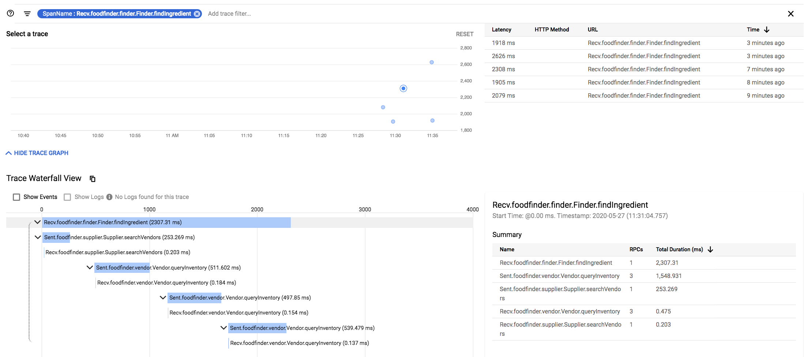

# OpenTelemetry Starter

The goal here is to create three services simulating a system to find food
stocks. At first, the services will be instrumented with OpenCensus. Then,
the same services will be instrumented with OpenTelemetry. Tracing and
metrics need to be sent to Google Cloud Monitoring (Stackdriver).

## Setup

In a shell:
```sh
python3 -m venv venv
source venv/bin/activate
pip install -r requirements.dev.txt
```

## Generate proto/gcp stubs

Run the codegen.sh script.

## Running each service
Each service is in a separate python package with a `main` module that you
can run e.g. `python -m foodfinder.finder.main`. For convenience, there are
some scripts to run each service and scripts to call each service with
`grpc_cli`. To run all at the same time, you can use `parallel` (moreutils):

```sh
# start the servers
parallel -- ./run_finder.sh  ./run_supplier.sh ./run_vendor.sh

# from another terminal, call finder searching for flour
./call_finder.sh flour
```

## Deploy to GCP
Run the `deploy.sh` script optionally with a `BRANCH` envar.

## Traces in GCP
Calling the deployed service, traces show up in GCP:

